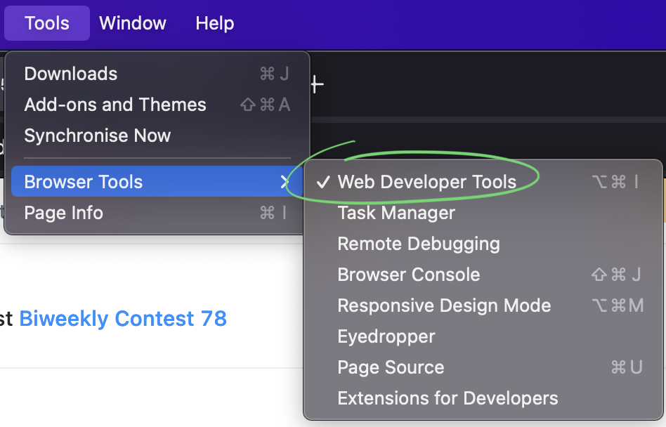

<h1>tinycode</h1>

<h3>Coding challenges in your favorite IDE or editor.</h3>

- [Getting Started](#getting-started) 
  - [HackerRank](#hackerrank)
  - [LeetCode](#leetcode)
- [Basic Usage](#basic-usage)
  - [login](#login)
  - [checkout](#checkout)
  - [submit](#submit)
- [Supported Languages](#supported-languages)
- [Contributing](#contributing)

## Getting Started

`tinycode` works with both LeetCode and HackerRank. Before you can
start solving problems, you must login with at least one of them.

### HackerRank

To get started on HackerRank, login with

```shell
$ tinycode login -p hackerrank
```

You will get prompted for your HackerRank username and password. You
can make sure you've been successfully logged in by checking out a
sample unsolved problem:

```shell
$ tinycode checkout --difficulty easy --track algorithms --lang cpp 
```

See [login](#login) for more on the `login` command.

### LeetCode

To use LeetCode, it is currently a bit more involved as
the LeetCode API does not support programmatic login and `tinycode` 
does not support extracting credentials from cookies (yet). 

Login on LeetCode with a browser and extract the CSRF and
session tokens from the developer console.

Here's how to do it with Firefox, but it's the same idea
with any browser you might be using.

Head over to
[https://leetcode.com/accounts/login/](https://leetcode.com/accounts/login/)
and login. Open the developer console (Tools > Browser Tools > Web Developer Tools 
on macOS).



Go to "Storage" and open the cookies for `https://leetcode.com`. You
should see two cookies, one for `csrftoken` and one for `LEETCODE_SESSION`.


Run the command `tinycode login -p leetcode` and paste the corresponding values when prompted:

```shell
$ tinycode login -p leetcode 
csrf: {paste your 'csrftoken' cookie value}
session token: {paste your 'LEETCODE_SESSION' cookie value}
```

You can test everything works as expected by running

```shell
$ tinycode checkout -p leetcode --lang rust
```

See [login](#login) for more on the `login` command.

## Basic Usage

### login

To login to a supported platform (HackerRank or LeetCode) use the `tinycode login` command. 

The available options are:

- `-p`/`--provider`: the problem provider to use, either `leetcode` or `hackerrank` (DEFAULT: `hackerrank`)
- `-s`/`--session`: manually set the session token (only required with `--provider=leetcode`)
- `-c`/`--csrf`: manually set the X-CSRF-Token (only required with `--provider=leetcode`)

The login credentials are saved under `$HOME/.config/tinycode/config.toml`.

### checkout

To check a problem out, use the `tinycode checkout` command. For example:

```shell
$ tinycode checkout -p leetcode --status todo -d easy -l rust
```

This command runs a search of available problems from the specified provider. 

The available options are:

- `-p`/`--provider`: the problem provider to use, either `leetcode` or `hackerrank` (DEFAULT: `hackerrank`)
- `-d`/`--difficulty`: limit search to a given difficulty, either `easy`, `medium` or `hard`
- `--status`: limit search to problems with a given "status", either `todo`, `attempted` or `solved`
- `-l`/`--lang`: limit search to problems that admit a solution in a specific language (e.g. `cpp`); 
  see [Supported Languages](#supported-languages) for the list of possible values
- `--id`: specify an exact problem id (e.g. `1`)
- `--problem`: specify an exact problem slug (e.g. `two-sum`)

The available flags are:

- `-o`/`--open`: if specified, open the checked out problem with the text editor configured in the `EDITOR`
  environment variable
- `-s`/`--submit`: if specified, implies `--open` and submit the solution immediately upon closing the editor

These options are **only** available when `--provider=leetcode`:

- `-t`/`--tags`: limit search to problems with the given tags; the tags should be specified 
  by a comma-separated list (e.g. `array,hash-table,graph`). The list of valid tags can be found 
  in the LeetCode dashboard under the tags search filter.

These options are **only** available when `--provider=hackerrank`:

- `--track`: limit search to problems belonging to a specific HackerRank "track". 
  These correspond to "Topics" from the GUI. Possible values are: 
  - `algorithms`
  - `data-structures`
  - `mathematics`
  - `ai`
  - `c`
  - `cpp`
  - `java`
  - `python`
  - `ruby`
  - `sql`
  - `databases`
  - `shell`
  - `fp`
  - `regex`

Adding a path argument to `tinycode checkout` will have the problem prompt and associated code stub saved to 
file at that path. With HackerRank, this also creates an `.html` file to be opened separately in a browser. 

If no path is specified the problem's code stub is output to stdout.

### submit

To submit a solution, you can use the `--submit` flag with `tinycode checkout` (see above) or the `tinycode submit`
command. For example:

```bash
$ tinycode submit -p hackerrank --problem a-very-big-sum --contest master --track algorithms a-very-big-sum.cpp 
```

If you are passing in a path to a file created by the `tinycode checkout`, none of the options below are required. 
For example:

```bash
$ tinycode checkout --track algorithms --lang cpp problem.cpp
$ emacs problem.cpp
$ tinycode submit problem.cpp
```

The available options are:

- `-p`/`--provider`: the problem provider to use, either `leetcode` or `hackerrank` (DEFAULT: `hackerrank`)
- `--id`: the problem id to submit a solution for (e.g. `1`)
- `--problem`: the slug of the problem to submit a solution for (e.g. `a-very-big-sum`)
- `-l`/`--lang`: the programming language for which to submit a solution to this problem (should match the language 
  used in the input file)

These flags are **only** available when `--provider=hackerrank`:

- `--purchase`: if specified, purchase the last failed testcase (using HackerRank credits)

## Supported Languages

An exhaustive list of the languages supported by `tinycode` (and the
accepted values for the `--lang` option) can be found in
[provider/provider.go](./provider/provider.go).

## Contributing

If you find a bug and know how to fix it - feel free to go ahead and [open
a PR][open-a-pr] for it! They will all be accepted. If you have a feature request, or 
encounter a problem while using `tinycode`, please [open an issue][open-an-issue] and 
let me know how to reproduce it. If you want to chat about something bigger you'd want
to work on, the easiest is to connect with me on Discord [94a84d2e#7864][find-me-on-discord]!

[open-a-pr]: https://github.com/brokad/tinycode/compare
[open-an-issue]: https://github.com/brokad/tinycode/issues/new
[find-me-on-discord]: https://discordapp.com/users/1001719492356866091